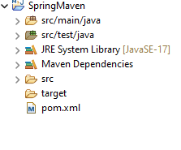
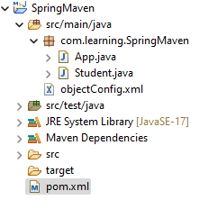

# Creating Beans in Maven Spring

Here we will first create basic maven project. Structure of the project given below.



## Create Student class in *source/main/java*  
Create package *com.learning.SpringMaven*

```java
package com.learning.SpringMaven;

public class Student {
	private int studentId;
	private String studentName;
	private String studentAddress;
	
	public Student() {
		
	}
	public Student(int studentId, String studentName, String studentAddress) {
		super();
		this.studentId = studentId;
		this.studentName = studentName;
		this.studentAddress = studentAddress;
	}
	public int getStudentId() {
		return studentId;
	}
	public void setStudentId(int studentId) {
		this.studentId = studentId;
	}
	public String getStudentName() {
		return studentName;
	}
	public void setStudentName(String studentName) {
		this.studentName = studentName;
	}
	public String getStudentAddress() {
		return studentAddress;
	}
	public void setStudentAddress(String studentAddress) {
		this.studentAddress = studentAddress;
	}
	@Override
	public String toString() {
		return "Student [studentId=" + studentId + ", studentName=" + studentName + ", studentAddress=" + studentAddress
				+ "]";
	}
}
```

## Creating Configration .xml file to configure beans
To create beans(beans refer to object). First we need to create a **.xml** file, you can name **.xml** as per your need. We are creating *objectConfig.xml* .

```xml
<?xml version="1.0" encoding="UTF-8"?>
<beans xmlns="http://www.springframework.org/schema/beans"    
		xmlns:xsi="http://www.w3.org/2001/XMLSchema-instance"
		xmlns:context="http://www.springframework.org/schema/context"
		xmlns:p="http://www.springframework.org/schema/p"    
		xsi:schemaLocation="http://www.springframework.org/schema/beans        
		https://www.springframework.org/schema/beans/spring-beans.xsd
		http://www.springframework.org/schema/context
		http://www.springframework.org/schema/context/spring-context.xsd">    
		
    <!-- we can create n numbers of bean here -->

</beans>
```

Now we will create bean for Student class.
- We used ***context schema***, it will help to link config file to your class. 
- We also used ***p schema*** to provide attributes to class objects.

```xml
<?xml version="1.0" encoding="UTF-8"?>
<beans xmlns="http://www.springframework.org/schema/beans"    
		xmlns:xsi="http://www.w3.org/2001/XMLSchema-instance"
		xmlns:context="http://www.springframework.org/schema/context"
		xmlns:p="http://www.springframework.org/schema/p"    
		xsi:schemaLocation="http://www.springframework.org/schema/beans        
		https://www.springframework.org/schema/beans/spring-beans.xsd
		http://www.springframework.org/schema/context
		http://www.springframework.org/schema/context/spring-context.xsd">    
		
		<!-- this is student bean -->
		<!-- bean using p schema -->
		<bean class="com.learning.SpringMaven.Student" name="StudentBean1" p:studentId="17859" p:studentName="Rahul Yadav"
		 p:studentAddress="Jaunpur, India" />
		
        <!-- bean using value parameter in property tag -->
		<bean class="com.learning.SpringMaven.Student" name="StudentBean2">
			<property name="studentId" value="17860" />
			<property name="studentName" value="Satya Singh" />
			<property name="studentAddress" value="Delhi, India" />
		</bean>
		
        <!-- bean using general method -->
		<bean class="com.learning.SpringMaven.Student" name="StudentBean3">
			<property name="studentId">
				<value>17861</value>
			</property>
			<property name="studentName">
				<value>Aniket Singh</value>
			</property>
			<property name="studentAddress">
				<value>Delhi, India</value>
			</property>
		</bean>
		<!-- more bean definitions for services go here --> 
		
</beans>
```

## Linking and passing beans for object creation

Now we need to add some code in path *source/main/java* inside package *com.learning.SpringMaven* one **app.class** file is there. This is the main execution file of our project.

```java
package com.learning.SpringMaven;
import org.springframework.context.ApplicationContext;
import org.springframework.context.support.ClassPathXmlApplicationContext;


public class App {
    public static void main(String[] args) {

        @SuppressWarnings("resource")
		ApplicationContext context = new ClassPathXmlApplicationContext("objectConfig.xml");
        
        Student student1 = (Student) context.getBean("StudentBean1");
        Student student2 = (Student) context.getBean("StudentBean2");
        Student student3 = (Student) context.getBean("StudentBean3");
        
        System.out.println(student1.toString());
        System.out.println(student2.toString());
        System.out.println(student3.toString());
    }
}
```

Here is the final project files structure.



***HAPPY LEARNING***  
[**Click**](/Leaning%20Notes/Day3.md) for Next Day